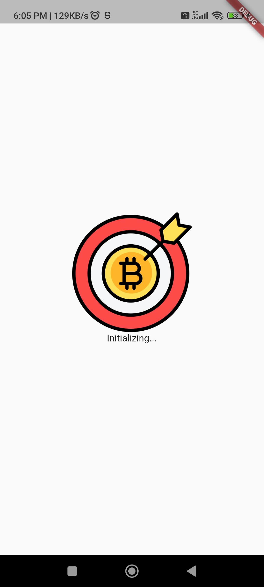
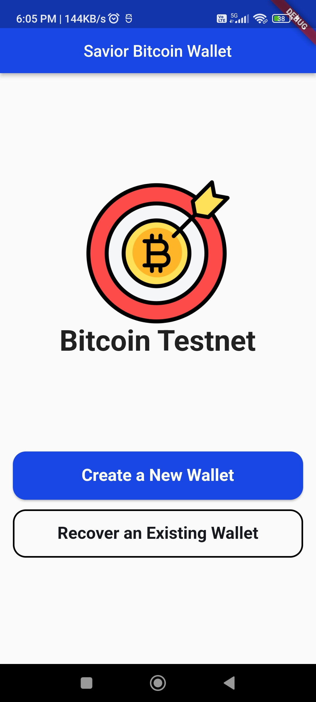
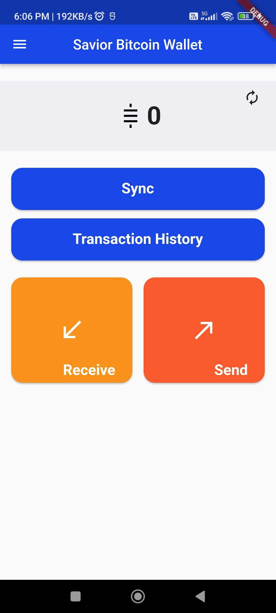
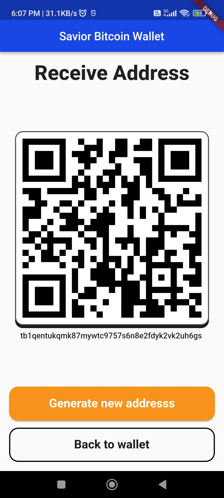
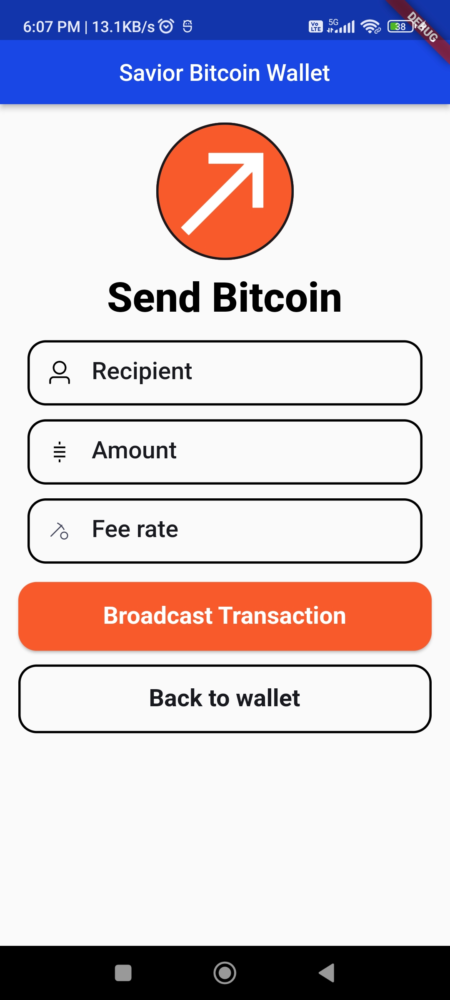
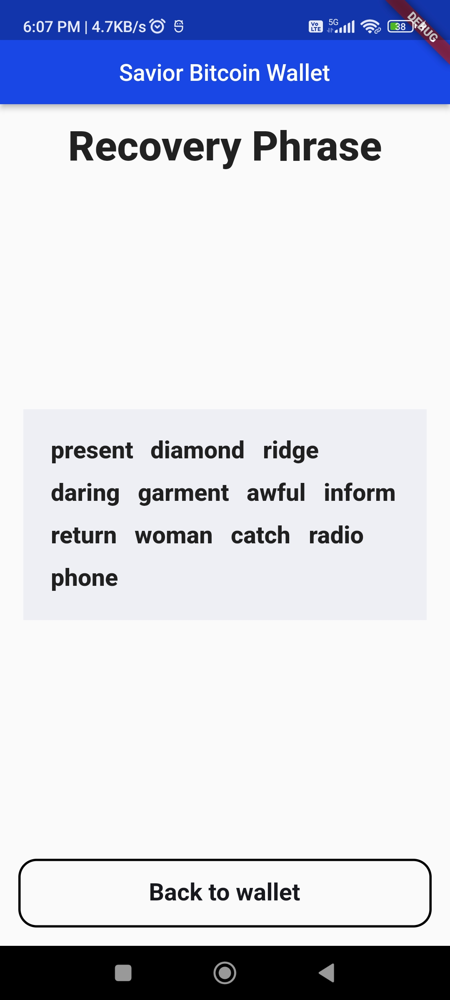
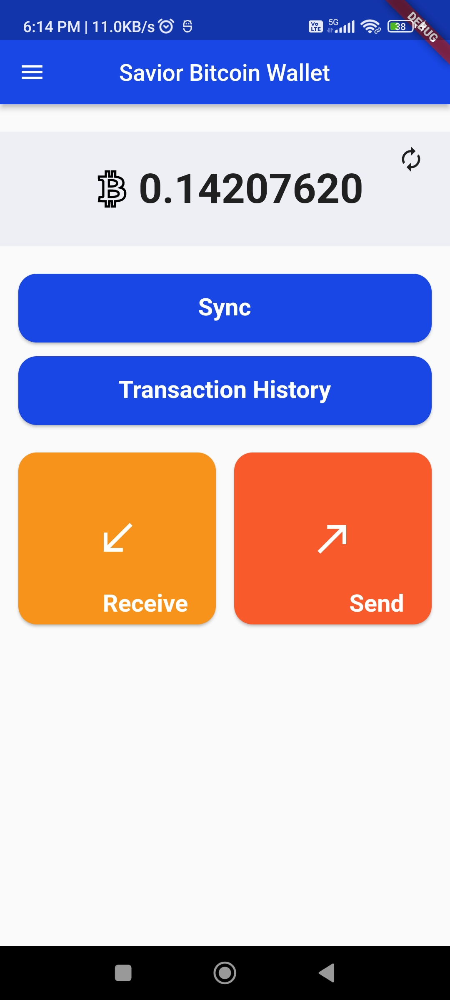
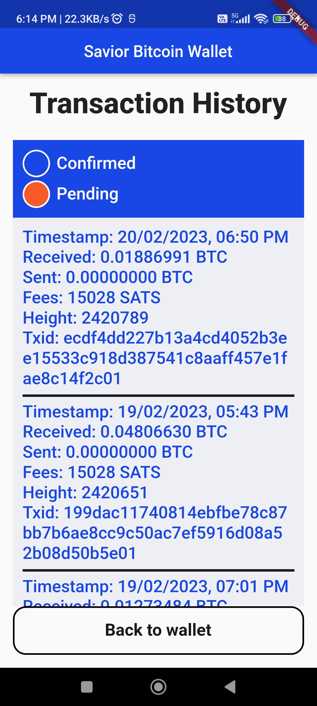
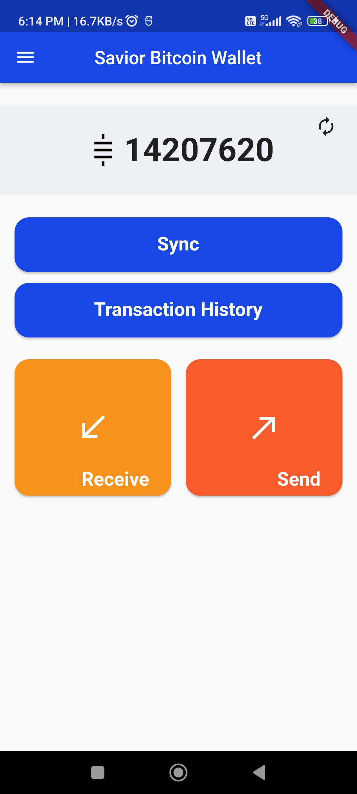
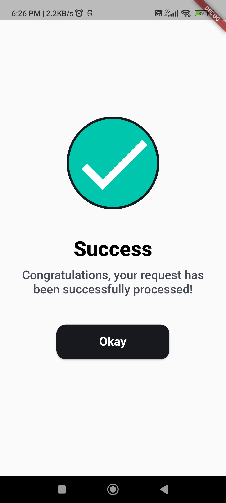

    
    <h1> Savior Bitcoin Testnet Wallet</h1>

<h3 align="center"> I'm excited to introduce you to Savior Bitcoin Wallet, which showcases the power of the Flutter framework and <a href="https://pub.dev/packages/bdk_flutter">BDK Flutter</a> in developing a secure and easy-to-use Bitcoin wallet. </h3>

## Screens Specification

Splash Screen                             |   CreateWallet Screen
:----------------------------------------:|:-------------------------:
  |  

Home Screen                         |   ReceiveAddress Screen
:--------------------------------:|:-------------------------:
  |  

Send Screen                         |   Recovery Phrase Screen
:--------------------------------:|:-------------------------:
  |  

Home Screen                         |   TxHistory Screen
:--------------------------------:|:-------------------------:
  |  

Home Screen                         |   Success Indicator Screen
:--------------------------------:|:-------------------------:
  |  

## Building

1. Clone the repo
2. Run `cd savior_bitcoin_wallet`
3. Run `make get`
4. Start Debugging

## Contributing:

 - Fork it!
 - Create your feature branch: `git checkout -b my-new-feature`
 - Commit your changes: `git commit -am 'Add some feature'`
 - Push to the branch: `git push origin my-new-feature`
 - Submit a pull request.

 <h3 align="center">Show some ❤ and star the repo to support the project</h3>