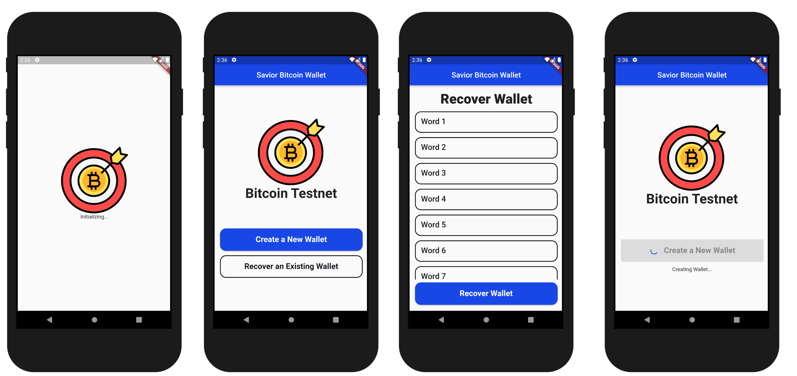
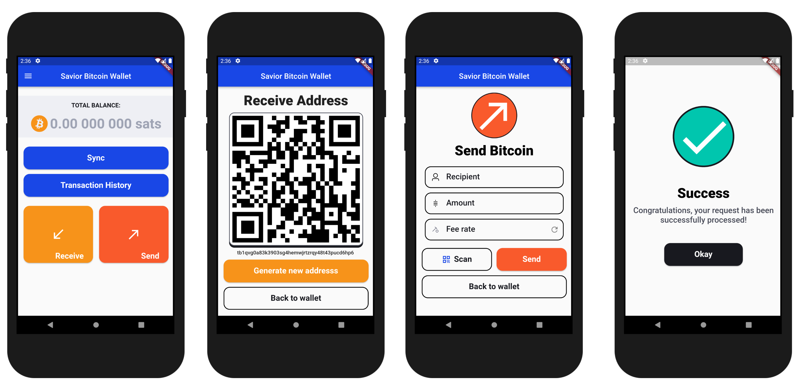
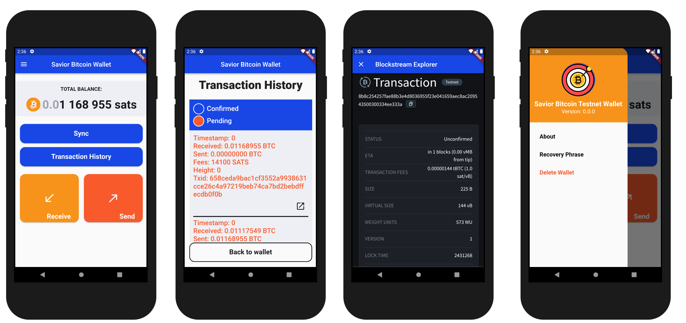

## 🌟 **Open to Work** 🌟

Hello there! 👋

If you or your team are working on projects similar to the ones you find in this GitHub repository, I'm open to collaboration and excited to contribute my skills as a developer.

I have a deep passion for developing mobile apps, and I'm eager to work on innovative and challenging tasks. You can find my resume [here](https://drive.google.com/file/d/12qOmW2rQDDKn3IwK25qbcDcJSc0GpV1W/view), which provides more details about my experience and qualifications.

If you see potential for collaboration or would like to discuss how I can contribute to your projects, please feel free to reach out to me at [aaa.software.dev@gmail.com](mailto:aaa.software.dev@gmail.com?subject=Job%20Opportunity&body=Hello,%0D%0A%0D%0AI%20am%20contacting%20you%20in%20response%20to%20your%20website%20and%20to%20inquire%20about%20your%20availability%20for%20a%20potential%20job%20opportunity%20as%20a%20software%20developer.%0D%0A%0D%0APlease%20let%20me%20know%20if%20you%20are%20interested%20in%20discussing%20further.%0D%0A%0D%0AThank%20you,%0D%0A[Your%20Name]%0D%0A[Your%20Contact%20Information]).

Thank you for taking the time to visit my repository. I look forward to potential opportunities to work together and create something amazing!

---

    
    <h1> Savior Bitcoin Testnet Wallet</h1>

<h3 align="center"> Savior Bitcoin Wallet is a non-custodial hierarchical deterministic Bitcoin wallet developed using Flutter and BDK. It is a secure and easy-to-use wallet that supports creating new wallets, recovering an existing wallet, sending Bitcoin, receiving Bitcoin, displaying transaction history, and using Blockstream Explorer in the in-app web view. </h3>

## Features
- Create New Wallet
- Recover Existing Wallet
- Send Bitcoin: Send Bitcoin to other Bitcoin addresses with a dynamic fee estimation feature to ensure that your transactions confirm as quickly as possible.
- Receive Bitcoin: Generate a new receiving address to receive Bitcoin from other people or services.
- Transaction History: Display a transaction history that shows all of your incoming and outgoing Bitcoin transactions.
- Blockstream Explorer: Explore the Bitcoin blockchain using Blockstream's open-source explorer in the in-app web view.

## Screen Specifications

## Architecture
The project is developed with the repository pattern and BLoC design for efficient state management. It is also made utilizing multiple local packages for modularity and scalability.

## Building

1. Clone the repo.
2. Navigate to the root directory of the project: `cd savior_bitcoin_wallet`.
3. Install the project dependencies: `make get`.
4. Start debugging.

## Contributing
We welcome and appreciate contributions to the project. If you'd like to contribute, please follow these steps:
 - Fork the repo.
 - Create your feature branch: `git checkout -b my-new-feature`.
 - Commit your changes: `git commit -am 'Add some feature'`.
 - Push to the branch: `git push origin my-new-feature`.
 - Submit a pull request.

## Acknowledgements
The project was developed with the support of [Bitcoin Development Kit - Flutter Package](https://github.com/LtbLightning/bdk-flutter).

 <h3 align="center">Please show some love and star the repo to support the project. Thank you!</h3>
